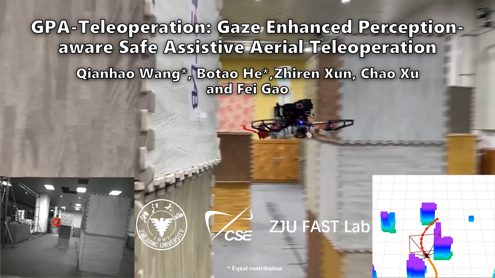
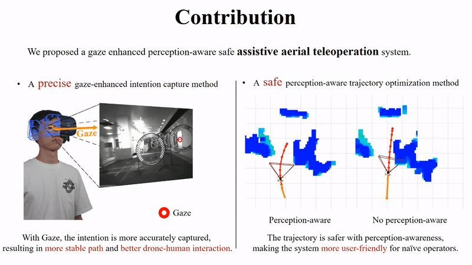

# GPA-Teleoperation
A gaze enhanced perception-aware assistive teleoperation framework.

<a href="https://www.youtube.com/watch?v=WYujLePQwB8" target="blank">
  <p align="center">
    
  </p>
</a>

**Video Links**: [youtube](https://www.youtube.com/watch?v=WYujLePQwB8) or [bilibili](https://www.bilibili.com/video/BV1Yf4y1P74v/?spm_id_from=333.337.search-card.all.click&vd_source=af77df9ab982b4567eb157030567c728)

## 0. Overview
**GPA-Teleoperation** is a gaze enhanced perception-aware assistive teleoperation framework. It simultaneously ensures safety and increases the perception awareness to environment of interest.

**Authors**: Qianhao Wang (qhwangaa@zju.edu.cn), Botao He (botao@umd.edu) and [Fei Gao](https://ustfei.com/) from the [ZJU Fast Lab](http://zju-fast.com/). 

**Paper**: [GPA-Teleoperation: Gaze Enhanced Perception-aware Safe Assistive
Aerial Teleoperation](https://ieeexplore.ieee.org/document/9720920), Qianhao Wang*, Botao He*, Zhiren Xun and Fei Gao, Published in IEEE Robotics and Automation Letters (RAL).

<p align="center">
    
</p>
<p align="center">
    
</p>
<p align="center">
    
</p>

## 1. Setup

### 1.1. Download

```
git clone https://github.com/ZJU-FAST-Lab/GPA-Teleoperation.git
cd GPA-Teleoperation
```
### 1.2 Depth Render
We use CUDA to render depth. Please remember to also change the 'arch' and 'code' flags in the line of 

```
  set(CUDA_NVCC_FLAGS 
      # set this according to your cuda version
      -gencode=arch=compute_86,code=sm_86 ;
  ) 
``` 
in _CMakeList.txt_ in the package __local_sensing__. If you encounter compiling error due to different Nvidia graphics card you use or you can not see proper depth images as expected, you can check the right code via [link1](https://arnon.dk/matching-sm-architectures-arch-and-gencode-for-various-nvidia-cards/) or [link2](https://github.com/tpruvot/ccminer/wiki/Compatibility).

### 1.3 Graphical User Interface (Gaze Simulator)

The Python package [tkinter](https://docs.python.org/3/library/tkinter.html) is used to create the videography interface. To install tkinter,
```
pip install pynput
```

 
### 1.4. Compilation

```
catkin_make
source devel/setup.sh
```

## 2. Run & Interation

```
roslaunch gpa_teleop sim.launch

# open a new terminal under the same directory
python3 src/gaze_sim/gaze_sim.py
```

Our GUI provides gaze simulation using the mouse. The gif below shows a demo that using mouse to indicate the human intention. 

Note: Due to the display updates in some versions of OpenCV 4, you may need to firstly move the mouse out of the display region and then scroll the wheel to adjust the speed

<p align="center">
    
</p>


## 3. Acknowledgement
We use [**MINCO**](https://github.com/ZJU-FAST-Lab/GCOPTER) as our trajectory representation.

We use [**EGO-Planner-v2**](https://github.com/ZJU-FAST-Lab/EGO-Planner-v2) as the target drone planner.

## 4. Citation
```bibtex
@ARTICLE{9720920,
  author={Wang, Qianhao and He, Botao and Xun, Zhiren and Xu, Chao and Gao, Fei},
  journal={IEEE Robotics and Automation Letters}, 
  title={GPA-Teleoperation: Gaze Enhanced Perception-Aware Safe Assistive Aerial Teleoperation}, 
  year={2022},
  volume={7},
  number={2},
  pages={5631-5638},
  doi={10.1109/LRA.2022.3153898}}
```

